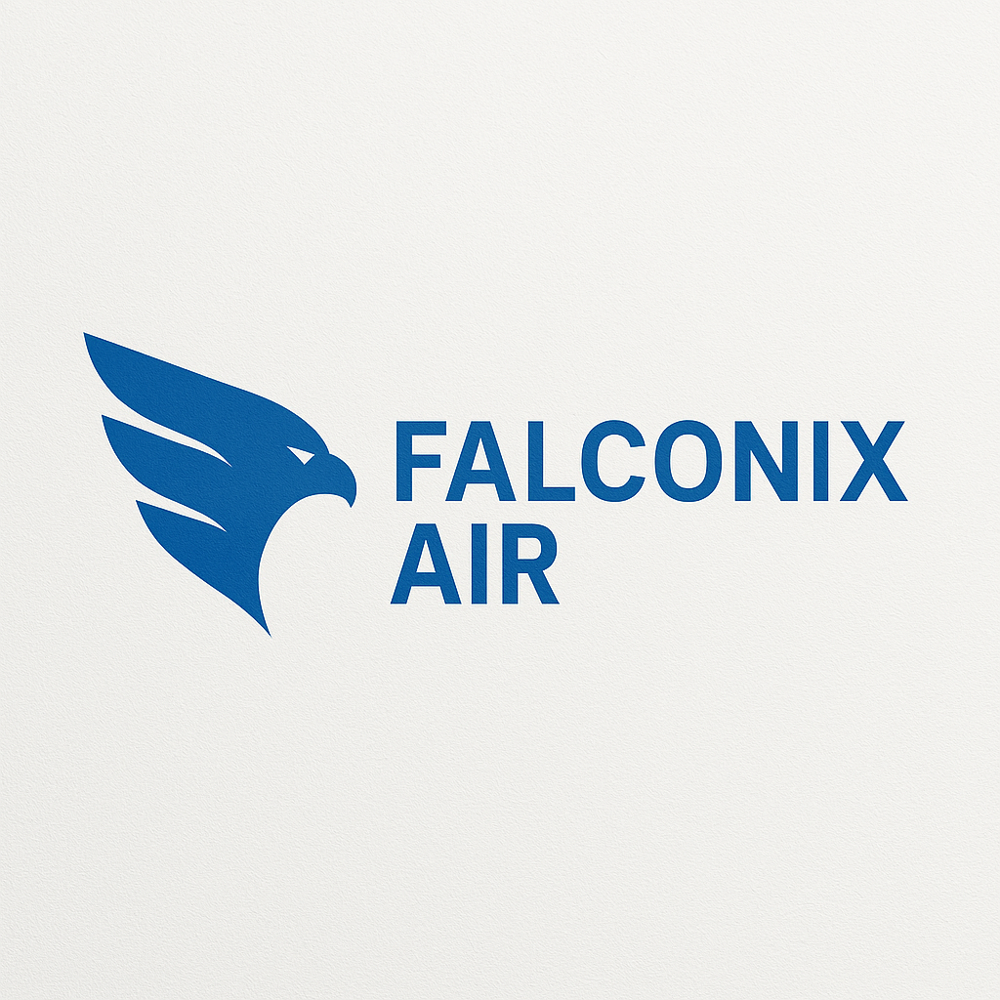

# ✈️ Our Fleet: Piper Navajo Chieftain

---

## 🛫 Aircraft Overview

The **Piper Navajo Chieftain** is the backbone of Falconix Air’s fleet. This twin-engine aircraft offers the perfect balance of performance, comfort, and affordability — ideal for short-haul regional charter missions.

---

## 📐 Specifications

| Feature | Details |
|--------|---------|
| Seating | Up to 9 passengers |
| Range | ~1,000 nautical miles |
| Cruise Speed | ~220 knots |
| Engines | Twin Lycoming TIO-540 |
| Cabin | Pressurized, executive layout options |

---

## 🧠 Why We Chose the Chieftain

- Proven reliability in charter operations
- FAA Part 135 compliant
- Low acquisition and maintenance costs
- Spacious cabin for business and leisure travelers
- Ideal for regional routes across the East Coast and Midwest

---

## 🖼️ Interior & Exterior Gallery

> _Coming soon: immersive 360° views and branded cabin layouts._

---

## 📦 Fleet Expansion Plan

Falconix Air will begin operations with **2 Piper Navajo Chieftains**, expanding to **6 aircraft** by 2037. Each aircraft will feature custom Falconix livery and upgraded avionics.

---

## 📬 Charter Inquiries

Book a flight or request a fleet demo:  
📧 **charter@falconixair.com**  
📞 **+1 (412) 555-1350**

---

© 2025 Falconix Air. All rights reserved.
